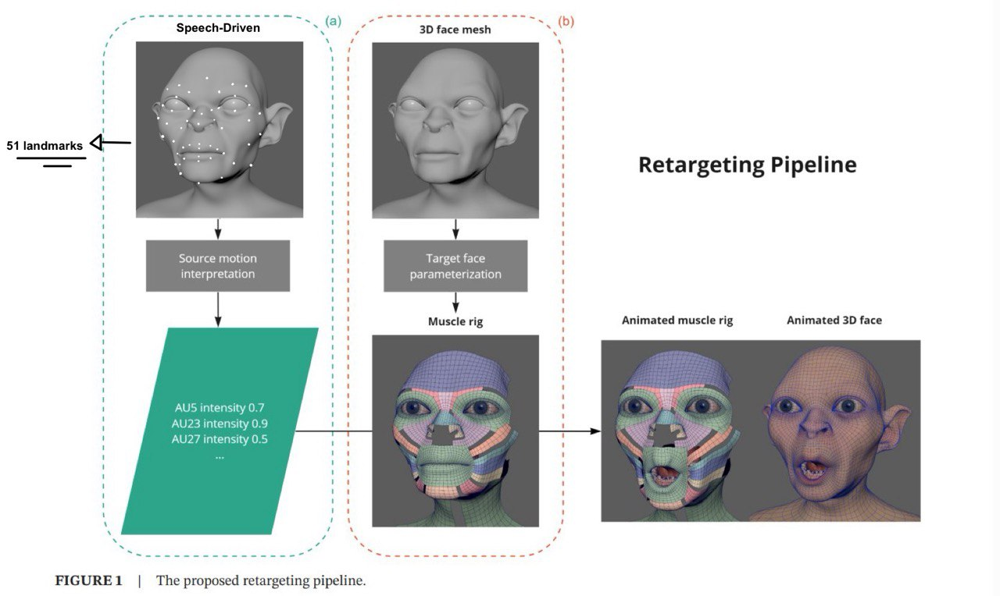
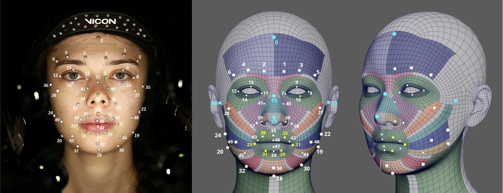
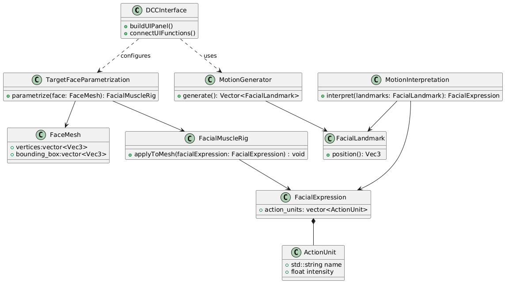
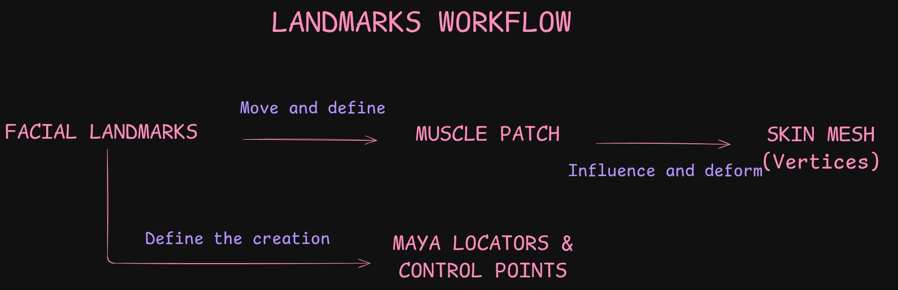
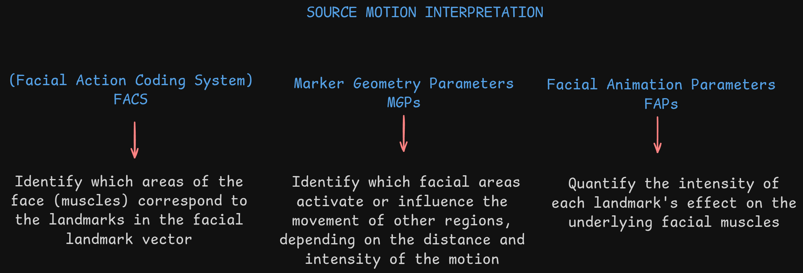
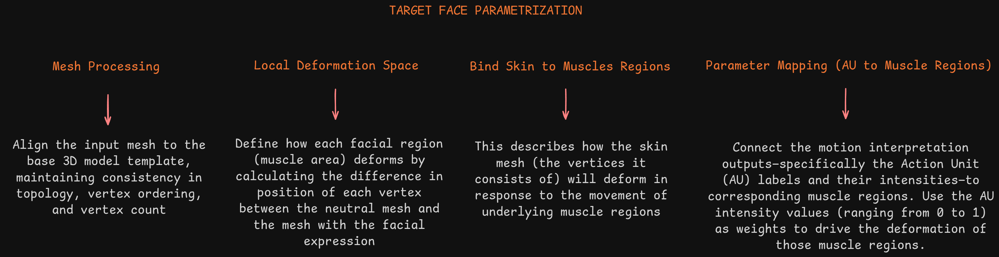
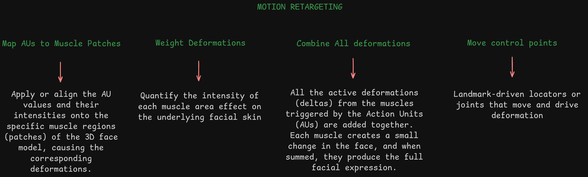

# Speech-Drive 3D Facial Animation



This project is designed to simplify the workflow for animators by providing boilerplate animation data compatible with **Autodesk Maya, a standard DCC (Digital Content Creation)** tool widely used in animation and video game development. **It delivers a plugin that integrates PixelMux technology into animation pipelines**,enabling the generation of facial animation from portraits and audio. Animators can create expressive facial motion while maintaining full control over the animation data directly within **Maya**.

## Paper Based on Application 
This application is based on the paper named as: A Facial Motion Retargeting Pipeline for Appearance
Agnostic 3D Characters (2024)

## Features
- **Facial animation from portraits and audio**
- **Maya plugin integration**

     - Updates animation data in the **Graph Editor**

     - Reflects changes in the **Time Slider**

     - Synchronizes values in the **Channel Box**

     - Displays attributes in the **Attribute Editor**

## Facial Landmarks System



The system we use is called **Dense Facial Landmarks**. Its goal is to **track facial geometry based on the density of key regions**, focusing on how facial muscles intersect and influence expression. The model uses a total of **51 landmark points** to represent critical areas of the face.

| No | Landmark Number | Landmark Vertex Template Mesh | Landmark Pixel-Mux |
|--- | --- | --- | --- |
| 1 | 0 | 3506 | 10 |
| 2 | 1 | 1108 | 336 |
| 3 | 2 | 1048 | 107 |
| 4 | 3 | 4934 | 296 |
| 5 | 4 | 5463 | 66 |
| 6 | 5 | 678  | 293 |
| 7 | 6 | 4586 | 53 |
| 8 | 7 | 1706 | 398 |
| 9 | 8 | 3889 | 263 |
| 10 | 9 | 3813 | 386 |
| 11 | 10 | 1505 | 374 |
| 12 | 11 | 1659 |173 |
| 13 | 12 | 2567 | 33 |
| 14 | 13 | 2853 | 159 |
| 15 | 14 | 4333 | 472 |
| 16 | 15 | 3256 | 6 |
| 17 | 16 | 2475 | 423 |
| 18 | 17 | 482 | 203 |
| 19 | 18 | 977 | 152 |
| 20 | 19 | 5329 | 397 |
| 21 | 20 | 3600 | 149 |
| 22 | 21 | 2428 | 273 |
| 23 | 22 | 419 | 361 |
| 24 | 23 | 3600 | 43 |
| 25 | 24 | 3641 | 172 |
| 26 | 25 | 4951 | 269 |
| 27 | 26 | 1731 | 39 |
| 28 | 27 | 1485 | 345 |
| 29 | 28 | 3065 | 116 |
| 30 | 29 | 4207 | 405 |
| 31 | 30 | 4544 | 378 |
| 32 | 31 | 3170 | 181 |
| 33 | 32 | 4100 | 149 |
| 34 | 33 | 1736 | 0 |
| 35 | 34 | 3193 | 17 |
| 36 | 35 | 4471 | 454 |
| 37 | 36 | 4089 | 234 |
| 38 | 37 | 3534 | 4 |
| 39 | 38 | 3579 | 278 |
| 40 | 39 | 4111 | 48 |
| 41 | 40 | 1213 | 437 |
| 42 | 41 | 3119 | 217 |
| 43 | 42 | 4943 | 408 |
| 44 | 43 | 1723 | 185 |
| 45 | 44 | 4540 | 431 |
| 46 | 45 | 2400 | 211 |
| 47 | 46 | 1739 | 11 |
| 48 | 47 | 3195 | 15 |
| 49 | 48 | 3266 | 416 |
| 50 | 49 | 661  | 192 |
| 51 | 50 | 2576 | 199 |

## Topology-Based Muscle-Rig

| Element | Description |
| --- | --- |
| Vertices | 6k |
| Uniform Topology | Ensures the rig works consistently across all meshes |
| Symmetry | Allows mirrored deformations and symmetrical muscle behavior. |
| Vertex Order| Enables automated muscle assignments based on consistent indexing |
| Single mesh | Facilitates continuous deformations and simplifies rigging.|

## MusclePatches TargetModel


Total template mesh vetices = 5958

| Muscle Name | Scientific Name | Vertices Count|
| --- | --- | --- |
| Muscle 1 | Frontalis_R_Ftls | 130 |
| Muscle 2 | Frontalis_L_Ftls | 130 |
| Muscle 3 | DepressorSupercilii_R_DS | 22 |
| Muscle 4 | Procerus_Pcrs | 40 |
| Muscle 5 | DepressorSupercilii_L_DS | 22 |
| Muscle 6 | OrbicularisOculi_OrbitalPart_R_OOcls | 194  |
| Muscle 7 | OrbicularisOculi_PalpebralPart_R_OOcls | 171  |
| Muscle 8 | OrbicularisOculi_OrbitalPart_L_OOcls | 194 |
| Muscle 9 | OrbicularisOculi_PalpebralPart_L_OOcls | 171 |
| Muscle 10 | LevatorLabiiSuperioris_R_LLS_LLSAN | 54 |
| Muscle 11 | NasalisMuscle_TranscersePart | 84 |
| Muscle 12 | LevatorLabiiSuperioris_L_LLS_LLAN | 54 |
| Muscle 13 | NasalisMuscle_AlarPart_R | 42 |
| Muscle 14 | NasalisMuscle_AlarPart_L | 42 |
| Muscle 15 | ZygomaticusMinor_R_ZMnr | 45|
| Muscle 16 | ZygomaticusMajor_R_ZMjr_Msstr_Ptry | 45 |
| Muscle 17 | Risorius_R_Rsrs_Bcc | 48 |
| Muscle 18 | DepressorAnguliOris_R_DAO | 36 |
| Muscle 19 | DepressorLabiiInferioris_R_DLI | 64 |
| Muscle 20 | Mentalis_Mtlss | 180 |
| Muscle 21 | DepressorLabiiInferioris_L_DLI  | 64 |
| Muscle 22 | DepressorAnguliOris_L_DAO  | 36 |
| Muscle 23 | Risorius_L_Rsrs_Bcc | 48  |
| Muscle 24 | ZygomaticusMajor_L_ZMjr_Msstr_Ptry | 45 |
| Muscle 25 | ZygomaticusMinor_L_ZMnr | 45 |
| Muscle 26 | OrbicularisOris_OOrs | 472 |
| Muscle 27 | Platysma_R | 486 |
| Muscle 28 | Platysma_L | 486 |

## Action Units 
This table have a relation between pair of landmarks (Marker Geometric Parameters), action units (AU) and muscles patches (Active and Passive)

| No | Action Unit | Name | Landmarks | Active Muscles | Passive Muscles |
| --- | --- | --- | --- | --- | --- |
| 1 | AU1 | Inner Brow Raiser | 0-1, 0-2 | 1, 2 | 3,4,5,6,7,8,9 |
| 2 | AU2 | Outer Brow Raiser Left | 0-5 | 2 | 8,9 |
| 3 | AU2 | Outer Brow Raiser Right | 0-6 | 1 | 6,7 |
| 4 | AU4 | Brown Lowerer | 0-3, 0-4 | 3, 4, 5 | 1,2,6,7,8,9 |
| 5 | AU5 | Upper Lid Raiser | 7-8, 9-10, 11-12, 13-14 | 7, 9 | 6, 8 |
| 6 | AU6 | Check Raiser Left | 8-27 | 8,9 | 12, 14, 25,24 |
| 7 | AU6 | Check Raiser Right |12-28 | 6,7 | 10, 13, 15,16 |
| 8 | AU7 | Lid Tightener DnLeft | 8-27 | 8,9 | none |
| 9 | AU7 | Lid Tightener UpLeft | 8-27 | 8,9 | none |
| 10 | AU7 | Lid Tightener DnRight | 12-28 | 6,7 | none |
| 11 | AU7 | Lid Tightener UpRight | 12-28 | 6,7 | none |
| 12 | AU9 | Nose Wrinkler Left | 15-40 | 12 | 4, 5, 11, 14, 25, 24, 26 |
| 13 | AU9 | Nose Wrinkler Right |15,41 | 10 | 3, 4, 11, 13, 15, 16, 26 | 
| 14 | AU10 | Upper Lip Raiser Left | 25-35, 26-36 | 12 | 14, 25, 26 |
| 15 | AU10 | Upper Lip Raiser Right | 25-35, 26-36 | 10| 13, 15, 26 | 
| 16 | AU11 | Nasolabial Deepener Left | 35-42 | 25 | 14 |
| 17 | AU11 | Nasolabial Deepener Right | 36-43 | 15 | 13 |
| 18 | AU12 | Lip Corner Puller Left | 21-35 | 24 | 12, 14, 22, 25, 26 |
| 19 | AU12 | Lip Corner Puller Right | 23-36 | 16 | 10, 13, 15, 18, 26 |
| 20 | AU14 | Dimpler Left | 21-22 | 23 | 21, 22, 24, 25, 26 |
| 21 | AU14 | Dimpler Right | 23-24 | 17 | 15, 16, 18, 19, 26 |
| 22 | AU15 | Lip Corner Depressor | 21-35, 23-36 | 18, 22 | 16, 19, 20, 21, 23, 24, 26 |
| 23 | AU16 | Lower Lip Depressor | 29-30, 31-32 | 19, 21 | 20, 26 |
| 24 | AU17 | Chin Raiser | 37-50 | 20 | 17, 19 21, 23, 26 |
| 25 | AU18 | Lip Pucker Left | 21-23, 33-34, 46-47 | 20, 26 | 12,14,21,22,23,24,25 |
| 26 | AU18 | Lip Pucker Right | 21-23, 33-34, 46-47 | 20, 26 | 10,13,15,16,17,18,19 |
| 27 | AU20 | Lip Stretcher Left | 44-45 | 28 23 | 21, 22, 24, 26 |
| 28 | AU20 | Lip Stretcher Right | 44-45 | 27, 17 | 16, 18, 19, 26 |
| 29 | AU22 | Lip Funneler Dn Left | 46,15, 21-23, 46-47 | 26 | 12, 14, 21 ,23 ,24, 25 |
| 30 | AU22 | Lip Funneler Dn Right | 46,15, 21-23, 46-47 | 26 | 10, 13, 15, 16, 17, 19|
| 31 | AU22 | Lip Funneler Up Left | 46,15, 21-23, 46-47 | 26 | 12, 14, 21 ,23 ,24, 25 |
| 32 | AU22 | Lip Funneler Up Right | 46,15, 21-23, 46-47 | 26 | 10, 13, 15, 16, 17, 19|
| 33 | AU22 | Lip Tighten Dn Left | 46,15, 21-23, 46-47 | 26 | 12, 14, 21 ,23 ,24, 25 |
| 34 | AU22 | Lip Tighten Dn Right | 46,15, 21-23, 46-47 | 26 | 10, 13, 15, 16, 17, 19|
| 35 | AU22 | Lip Tighten Up Left | 46,15, 21-23, 46-47 | 26 | 12, 14, 21 ,23 ,24, 25 |
| 36 | AU22 | Lip Tighten Up Right | 46,15, 21-23, 46-47 | 26 |10, 13, 15, 16, 17, 19 |
| 37 | AU23 | Lip Tightener | 21-23, 46-47 | 26 | 10,12,15,16,17,18,19,21,22,23,24,25 |
| 38 | AU24 | Lip Depressor | 15-33 | 26 | 10,12, 15, 16, 17,19, 21, 23,24, 25 |
| 39 | AU25 | Lip Part | 18-19-20, 46-47 | 26, 19, 20, 21 | 17, 23 |
| 40 | AU26 | Jaw Drop | 18-19-20 | 16, 24 | 10,12,13,14,15,17,19,20,21,23,25,27,28 |
| 41 | AU27 | Mouth Stretch | 18-19-20 | 16,24 | 10,12,13,14,15,17,19,20,21,23,25,27,28 |
| 42 | AU30 | Jaw Sideways Left | 15-18 | 24 | 20,21,22,23,26,28 |
| 43 | AU30 | Jaw Sideways Right | 15-18 | 16 | 17,18,19,20,26,27 |
| 44 | AU41 | Lid droop | 7-8, 9-10 | 6,7,8,9 | None |
| 45 | AU42 | Slit Left| 8-27 | 8,9 | 2,4,5 |
| 46 | AU42 | Slit Right| 12-28 | 6,7 | 1,3,4 |
| 47 | AU43 | Eyes Closed | 7-8, 9-10 | 6,7,8,9 | None |
| 48 | AU44 | Squint | 8-27, 12-28 | 6,7,8,9 | 1,2,3,4,5 |
| 49 | AU45 | Eyes Closed Left | 7-8, 9-10 | 8,9 | None |
| 50 | AU45 | Eyes Closed Right | 11-12, 13-14 | 6,7 | None |

The following table lists the maximum number of vertices per action unit that the system must process. This helps us assess the required performance and evaluate the computational workload.

 No | Action Unit | MaxVertices |
| --- | --- | --- |
| 1 | AU1 | 1074
| 2 | AU2 | 495
| 3 | AU2 | 495
| 4 | AU4 | 1074
| 5 | AU5 | 730
| 6 | AU6 | 551
| 7 | AU6 | 551
| 8 | AU7 | 365
| 9 | AU7 | 365
| 10 | AU7 | 365
| 11 | AU7 | 365
| 12 | AU9 | 804
| 13 | AU9 | 804
| 14 | AU10 | 613
| 15 | AU10 | 613
| 16 | AU11 | 87
| 17 | AU11 | 87
| 18 | AU12 | 694
| 19 | AU12 | 694
| 20 | AU14 | 710
| 21 | AU14 | 710
| 22 | AU15 | 990
| 23 | AU16 | 780
| 24 | AU17 | 876
| 25 | AU18 | 986
| 26 | AU18 | 986
| 27 | AU20 | 1151
| 28 | AU20 | 1151
| 29 | AU22 | 770
| 30 | AU22 | 770
| 31 | AU22 | 770
| 32 | AU22 | 770
| 33 | AU22 | 770
| 34 | AU22 | 770
| 35 | AU22 | 770
| 36 | AU22 | 770
| 37 | AU23 | 1056
| 38 | AU24 | 972
| 39 | AU25 | 876
| 40 | AU26 | 1748
| 41 | AU27 | 1748
| 42 | AU30 | 1331
| 43 | AU30 | 1331
| 44 | AU41 | 730
| 45 | AU42 | 557
| 46 | AU42 | 557
| 47 | AU43 | 730
| 48 | AU44 | 1074
| 49 | AU45 | 365
| 50 | AU45 | 365

**Note "Future Improvements: On average, the system processes 775 vertices per action unit, since each action unit involves multiple muscles (active and passive). This workload isn’t heavy, but it opens the door to using contiguous memory layouts for better performance. That approach can be faster, but it’s harder to debug—so I’d like to validate the concept first.**

## System Design

### Workflow


### UML


### Landmarks workflow



### Source Motion Interpretation


### Target Face Parametrization



### Motion Retargeting



## Prerequisites (Linux)
- [Maya Devkit minimum GCC 11.2.1](https://aps.autodesk.com/developer/overview/maya)
- C++17 

***Note: Important information about the Devkit!!!!: after downloading and decompressing it, you need to:***
```
cd Devkit/include
tar -xzf qt_5.15.2-include.tar.gz
```
***Otherwise, you may encounter issues with Qt and some Maya libraries.***

## Requirements

1. run the next command:
```
cd cmd/retargeting
./requirements.sh
```

2. run the next command:
```
cd ../../
vcpkg install 
```

## Build Instructions

```
./build.sh
```

## Timeline
Link: https://docs.google.com/spreadsheets/d/1x9G0XLGNLBWYCOzbNsvGBKxYSU4ziLk73EwxFMBnzFg/edit?usp=sharing

## Project Management
Link: https://bournemouth-team-nk4tu6dm.atlassian.net/jira/software/projects/MAS/boards/35?atlOrigin=eyJpIjoiYzI2YjA3MzA2YzAwNGE3YmJjNzZiMjI5ODcxMTE0MGQiLCJwIjoiaiJ9

## Useful Links
-[ Maya SDK/Devkit Setup Linux](https://help.autodesk.com/view/MAYADEV/2026/ENU/?guid=Maya_DEVHELP_Setting_up_your_build_Linux_environment_html)
- https://help.autodesk.com/view/MAYAUL/2026/ENU/?guid=GUID-83C9793D-54AB-4BA3-812B-005D8153A79C
- https://download.autodesk.com/us/maya/2010help/api/class_m_fn_skin_cluster.html
- https://imotions.com/blog/learning/research-fundamentals/facial-action-coding-system/
- https://imotions.com/blog/learning/research-fundamentals/facial-action-coding-system/?srsltid=AfmBOop8kRPovAn-gvcuY2s7Cl1c7AchXmI4CL_3zS-ud2xIMwRWc_vU
